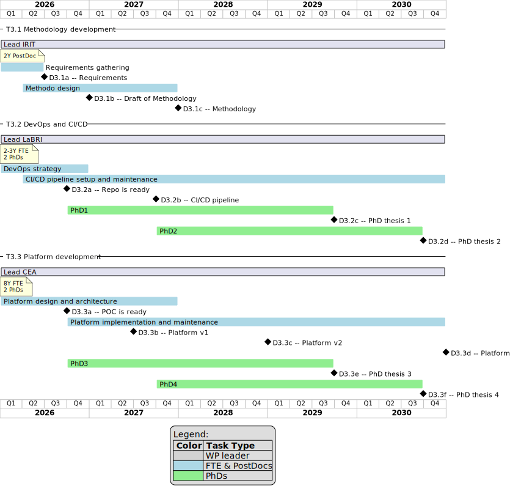

= PC3 Organization
Jean-Michel Bruel; Sophie Ebersold; Mariya Naumcheva
{localdate}
//------------------------- configuration
// :imagesdir: images
:icons: font
:toc: left
:numbered!:

// icons for GitHub https://gist.github.com/rxaviers/7360908
ifdef::env-github[]
:tip-caption: :bulb:
:note-caption: :information_source:
:important-caption: :heavy_exclamation_mark:
:caution-caption: :fire:
:warning-caption: :warning:
endif::[]
//-------------------------------------

This repository contains the organizational materials for the PC3 project.

== Homework

Demandé par Benoit et Pascale :

[%interactive]
- [ ] sélectionner une liste de partenaires (institut/labo/equipe/contact/sujet) pour les sujets prioritaires (qui rentre dans la rectification budgétaire). Il faut favoriser un projet scientifique cohérent, et donc pas de problème pour revoir l’histoire / organisation du PC au vue de la coupe budgétaire (i.e., vous souhaitez enlever un WP, ou les revoir pour mieux balancer si un déséquilibre se crée, etc.) => voir https://overleaf.irisa.fr/project/66d9dcb7f67f29009806bcd7 
- [ ] définir les livrables et la timeline (en s’alignant sur la timeline générale du programme)
- [ ] définir les indicateurs d’évaluation du PC, sur les dimensions communauté, science, plateforme, et démonstrateurs & use cases.
- [ ] Comité scientifique: 2 noms par PC [deadline: 31 octobre]
- [ ] Mise à jours du document de la proposition de programme  en fonction de la rectification scientifique, et avec les livrables et indicateurs. [deadline: 31 octobre]

=== Plateforme

Je pensais intialement à *DTaaS* (Digital Twin as a Service) - plateforme de jumeaux numériques pour la fabrication et la logistique

WARNING: Attention, le nom existe déjà : mailto:prasad.talasila@ece.au.dk[Prasad Talasila]  développe https://github.com/INTO-CPS-Association/DTaaS[DTaaS], une plateforme open-source à Aarhus (cf. Antoine Beugnard).

Du coup, proposition de nommer les différents "blocks" du projet de la façon suivante (par exemple) :

- EDT.fab (ou EDT.build) : la plateforme de construction de jumeaux numériques
- EDT.run : la plateforme d'exécution de jumeaux numériques
- EDT.dev : la méthodologie de création et d'utilisation des jumeaux numériques
- EDT.ops : la plateforme de déploiement continue et de gestion des jumeaux numériques
- EDT.comp : les composants réutilisables pour la création de jumeaux numériques
- EDT.network : la communauté des utilisateurs et contributeurs de la plateforme
- EDT.sim : le module de simulation pour les jumeaux numériques
- EDT.xyz : autre module de la plateforme

Avec en plus une possibilité de structurer les blocks :

IMPORTANT: Je pense qu'il faut vraiment garder la notion de "as a Service".

=== Tasks and Issues

Voici l'organisation générale (sur 5 ans) des tâches et des livrables du PC3 :

ifdef::env-github[]

endif::[]

ifndef::env-github[]

.PC3 Gantt Chart -- {localdate}
[plantuml, gantt, svg]
----
include::pc3-gantt.plantuml[]
----

endif::[]

=== Livrables

[quote]
----
include::pc3-deliverables.plantuml[]
----

=== Sujets

Plusieurs thématiques importantes sont remontées et nécessitent concertation pour décider des co-encadrements et des priorités :

- Postdoc WP1
- Postdoc WP2
- PhD1 WP2 => Sustainability
- PhD2 WP3 => Collaboratif(ou WP1 du coup ?)
- PhD3 WP4 => Sylvain / IGN
- PhD4 WP5 => CEA

=== Éléments d'évaluation (KPIs)

Quelques idées (pas déclinées sur les jalons) :

[cols="1,2,1", options="header"]
|===
|KPI |Description |Type
|Taux de complétion des tâches  | Pourcentage des tâches complétées par rapport aux tâches totales  | Plateforme / Science
|Respect des délais             | Pourcentage des livrables soumis dans les délais prévus           | Plateforme / Science
|Nombres de contributeurs       | Nombre de contributeurs majeurs différents (INRIA, CEA, ...)      | Plateforme / Communauté
|Durée moyenne des thèses       | Durée moyenne des thèses en mois (idéal 3 ans)                    | Science
|Attractivité des sujets        | Nombre de candidatures reçues par sujet de thèse                  | Science
|Citations des publications     | Nombre de citations des publications liées au projet              | Science
|Citation de la plateforme      | Nombre de mentions de la plateforme (presse, blog, etc.)          | Communauté
|Adéquation aux Use Cases       | Pourcentage des Use Cases couverts par la plateforme              | Plateforme / Communauté
|Satisfaction des utilisateurs  | Score moyen de satisfaction des utilisateurs (enquête annuelle)   | Plateforme / Communauté
|Job satisfaction  | Score moyen de satisfaction des embauchés | Plateforme 
|Consommation énergétique  | Mesure de la consommation énergétique de la plateforme | Plateforme
|===

// From Antoine:
// Quelques idées de KPI qu’on avait adopté pour un projet européen non retenu…
// Il y avait des évaluations sociales/socio/humaine avant puis après introduction de DT dans des industries…

// 1. Job satisfaction (JS) Workplace IT satisfaction (WIS)
// 2. Autonomy of the workers
// 3. Team connection and affinity
// 4. Motivation of workers
// 5. Interactions between workers
// 6. Stress and workload
// 7. Safety of workers

// On avait des partenaires des SHS avec nous pour l'évaluation…

// On peut imaginer des choses sur la consommation énergétique, le stockage de données, la réutilisation de modèles, de données … du système complet (DT+SR).

=== Liens Sujets/livrables/KPIs

// == Idées diverses   

